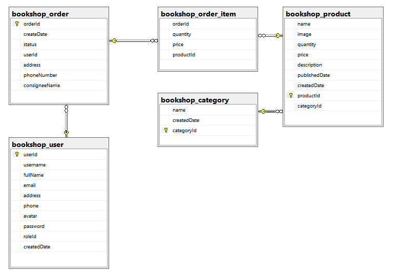
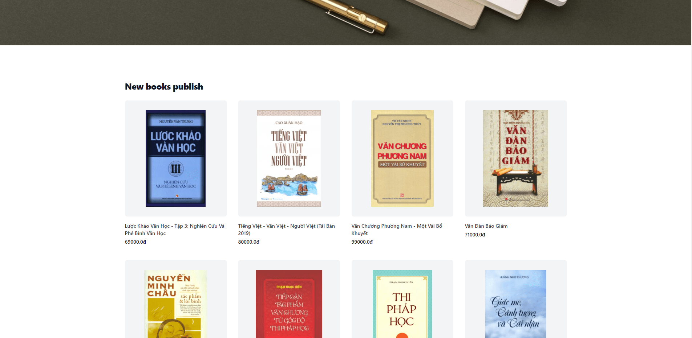
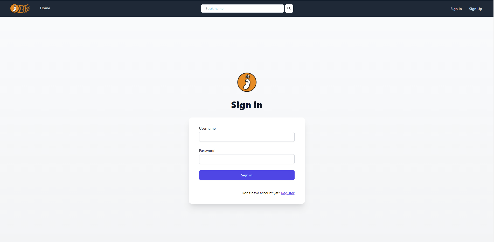
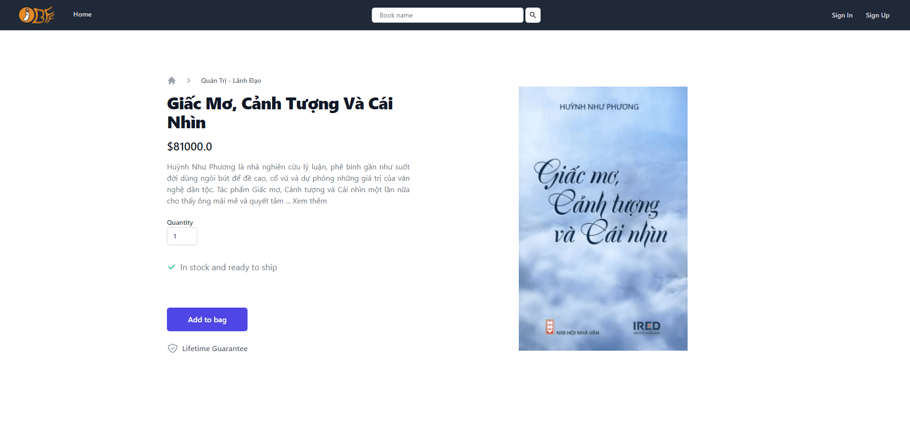

# BFF Shop - Servlet + JSP + Tailwind

## Case Study

This website is an online book store which provides an online shopping cart for customer to add and purchase their order. Moreover, this system also provides services for administrator to manage product, view the order history.

## Feature by role

- ### Both Role Action

  - Login, register new account and logout
  - Change password
  - Update user information

- ### Customer Role Action

  - Search book and filter book by price and category
  - Add and remove new book to cart
  - Checkout order
  - Cancel order
  - Review all order user have made
  - Checking each order information

- ### Admin Role Action

  - Add new category
  - Create new book
  - Update information for a book
  - Change status of order
  - Manage all book
  - Manage all order

## Technology

- Frontend
  - JSP - Server Side Rendering
  - Tailwind - Styling
  - Javascript
- Backend
  - Servlet - Server Core
  - SQL Server 2019 - Database
- Deployment
  - Docker - Container Management

## Team Member

- Đậu Lê Đức | Full-Stack
  - Gmail: dauleduc2@gmail.com
  - Linkedin: www.linkedin.com/in/ducdauu
  - Github: https://github.com/dauleduc2
- Nguyễn Hoàng Lộc | Backend
  - Gmail: hoanglocst900@gmail.com
  - Linkedin: https://www.linkedin.com/in/locnguyenhoang/
  - Github: https://github.com/niskyB
- Thạch Chí Khang | Backend
  - Gmail: chikhang4566@gmail.com
  - Linkedin: www.linkedin.com/in/thachchikhang
  - Github: https://github.com/Banan-a

## Project Picture

### Database Diagram

#### Relation Diagram

### Home Page

### Management Page

### Login Page

### Product In Detail

### 4MAN © 2021
